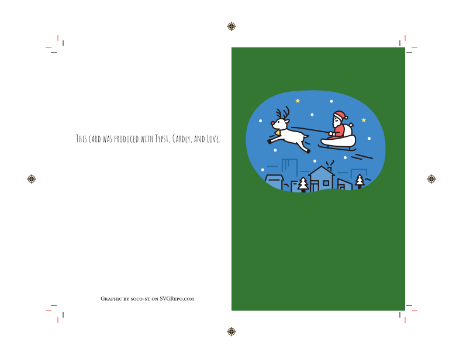
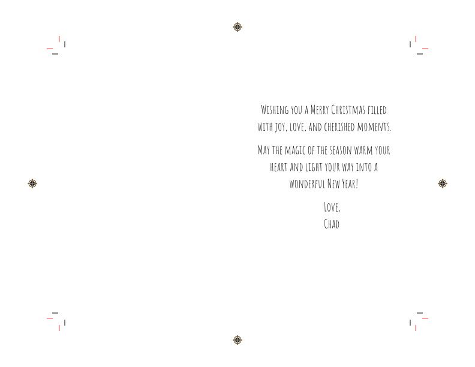

[Typst](https://typst.app/home/) template for making custom folded greeting cards.

This template uses [markly](https://typst.app/universe/package/markly/) to draw cut and bleed lines so that users can produce cards of various sizes that print to the edge.

Since markly centers the content area, if page 2 is printed on the back of page 1, the cut marks should align.


# Demo





# Requirements

* [Typst](https://typst.app/home/) 0.14.0
* [Markly](https://typst.app/universe/package/markly/) (*Will automatically download on compile*)
* [Amatic SC](https://fonts.google.com/specimen/Amatic+SC) (Only for provided demo)


# Steps

1. Install any required fonts.
2. Print front and back on 110lb paper (or the max your printer can handle).
3. Using a ruler and the dull side of a kitchen knife, [score the paper](https://www.youtube.com/watch?t=124&v=S4gOaxWf3MU) down the middle where you will fold the card.
4. Align a ruler to black lines and cut with a craft knife.

   WARN: Don't cut entire length of the paper or you'll separate the cut marks you need for cuts in the other direction.

5. Fold along scored line made in step #2.


# Syntax

`card_param.typ`:
```typst
// How far past cut lines we want to print
#let bleed = 9pt

// Size of the paper we're printing on (us-letter landscape)
#let stock-width = 11in
#let stock-height = 8.5in

// Size of the content area without bleed area
// - Double height for horizontal fold
// - Double width for vertical fold
#let content-height = 6in
#let content-width = 4in*2
```

`main.typ`:
```typst
#import "card_param.typ": * // configure parameters here
#import "card.typ": *

#show: setup

// Select a font
#set text(size: 20pt, font: "Amatic SC")

#card(
  front: [],
  inside-left: [],
  inside-right: [],
  back: []
)
```

## Helper Functions

If you want to center text without the bleed area, use `to-cut-left(content)` for `back` and `inside-left` and `to-cut-right(content)` for `front` and `inside-right`.  There are functions per side because there is no "margin" next to the fold.

To add additional margin, use `margin(length: 1cm, content)`.

```typst
#card(
  front:        to-cut-right(margin(length: 1cm)[Front]),
  inside-left:  to-cut-left( margin(length: 1cm)[Left]),
  inside-right: to-cut-right(margin(length: 1cm)[Right]),
  back:         to-cut-left( margin(length: 1cm)[Back]),
)
```

## Centering

`top-third(content)`: Centers around the top third of the page
`centered(content)`: horizontally centers the content

## Tiling background

```typst
#card(
  front: block(
    width: 100%,
    height: 100%,
    fill: tiling(image(width: 1in, "background.jpg")),
    to-cut-right(top-third(align(center, image("christmas-santa-and-reindeer-svgrepo-com.svg", width: 83%))))
  ),

  ...
)
```

## Cropping and Panning Images

A `block` can be used to clip an image to allow for zooming.  Pan the image before clipping by modifying `inset`.

```typst
#card(
  front: block(
    width: 100%,
    height: 100%,
    clip: true,
    // stroke: black, // show full block to cut marks
    inset: (top:-6mm, left:-54pt), // adjust top/left and height for zoom/pan
    image("van_gogh.jpg", height: 105%)
  ),
  ...
)
```

## Vertical Folding Cards

To support cards that fold down (vertically), change the values in `card_param.typ` to use portrait and double the height rather than the width like so:

```typst
// How far past cut lines we want to print
#let bleed = 9pt

// us-letter portrait
#let stock-width = 8.5in
#let stock-height = 11in

// Double height for horizontal fold
#let content-height = 4in*2
#let content-width = 6in
```

Then, change `card()` to `vcard()`.

NOTE: The parameters are different.

```typst
#vcard(
    front:[],
    inside-top:[],
    inside-bottom:[],
    back:[]
)
```

An example is located in the `vcard` folder.

# Attribution

"Christmas Santa And Reindeer SVG" icon by soco-st is licensed under CC BY 4.0.

Source: <https://www.svgrepo.com/svg/493377/christmas-santa-and-reindeer>  
License: <https://creativecommons.org/licenses/by/4.0/>


"Christmas Tree SVG Vector" icon by soco-st is licensed under CC BY 4.0.

Source: <https://www.svgrepo.com/svg/492733/christmas-tree>  
License: <https://creativecommons.org/licenses/by/4.0/>
